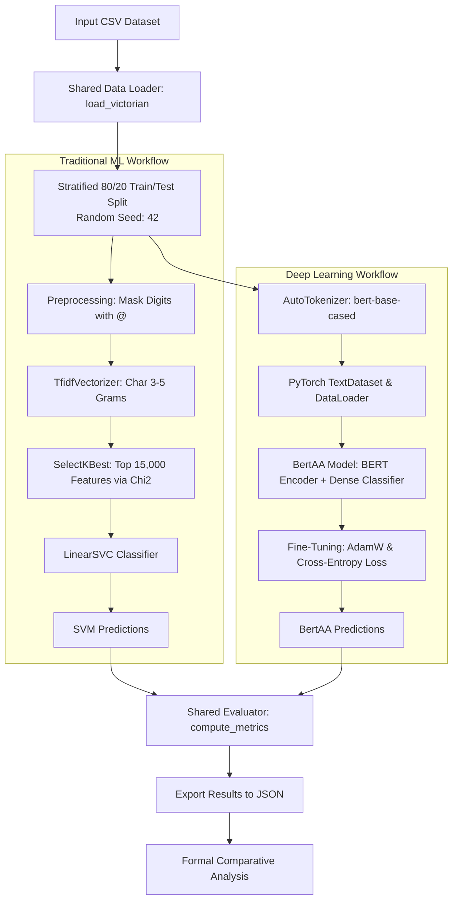

# 1. Problem Statement

Authorship attribution is a Natural Language Processing task in which the objective is to identify the author of a text based on its linguistic and stylistic characteristics. Given a document and a fixed set of possible authors, the system must predict which author most likely wrote that document.

This task belongs to the broader field of stylometry, which studies measurable writing habits. Authors often differ in vocabulary choice, punctuation usage, character patterns, sentence construction, function word frequency, and other stylistic markers. Even when two texts discuss similar topics, their writing style may contain enough signals to distinguish between authors. For this reason, authorship attribution is useful in literary analysis, forensic linguistics, plagiarism investigation, historical text analysis, and digital humanities.

In this project, the task is treated as a supervised multi-class text classification problem. Each text sample has an associated author label, and the model learns from examples of texts written by known authors. After training, the model receives unseen text samples and predicts one author from the same set of known authors.

Formally, let:

```text
A = {a1, a2, ..., ak}
```

be the set of possible authors, and let:

```text
x = (w1, w2, ..., wn)
```

be an input text represented as a sequence of words, tokens, or characters. The goal is to learn a classification function:

```text
f(x) -> A
```

which assigns the input text `x` to one author from the set `A`.

The main challenge is that authorship attribution should ideally capture writing style rather than only topic. If a model relies too heavily on topic-specific words, it may learn what an author writes about instead of how the author writes. Therefore, the project compares two different approaches:

1. A traditional machine learning method based on text features and Support Vector Machines.
2. A deep learning method based on fine-tuning BERT for authorship attribution.

The purpose of comparing these methods is to evaluate how a classical feature-based approach performs against a modern transformer-based approach on the same authorship attribution dataset and under the same experimental protocol.

# 2. Proposed Solution

The proposed solution consists of two supervised classification approaches applied to the same authorship attribution task. Both approaches receive text as input and output the predicted author label. They differ mainly in how the text is represented before classification.

The first approach uses traditional machine learning. The text is converted into numerical features using character n-gram TF-IDF vectors, the most relevant features are selected using the chi-square statistical test, and a linear Support Vector Machine classifier is trained on those features. This approach depends on explicit feature extraction and is closely related to classical stylometric methods.

The second approach uses deep learning. A pre-trained BERT model is fine-tuned on the authorship attribution dataset. Instead of manually designing features, BERT learns contextual representations of the input text and uses them to classify the author.

Both methods are evaluated using the same dataset split, the same author subset, and the same metrics: accuracy, macro-F1, weighted-F1, per-author precision/recall/F1, and a confusion matrix.

## 2.1. Theoretical Aspects and Formal Description of the Methods

### 2.1.1. Support Vector Machine with Character N-gram Features

The first method is based on the idea that an author's writing style can be represented through recurring lexical and character-level patterns. These patterns can be captured using n-grams.

An n-gram is a sequence of `n` consecutive units. Depending on the chosen representation, the units can be words or characters. For example, in a character-level representation, the word:

```text
author
```

contains character 3-grams such as:

```text
aut, uth, tho, hor
```

Character n-grams are especially useful for authorship attribution because they capture stylistic information that does not depend only on vocabulary. They can reflect punctuation habits, prefixes, suffixes, frequent word fragments, spelling tendencies, and formatting patterns. In this implementation, the SVM method uses character n-grams with lengths from 3 to 5.

Before feature extraction, a simple preprocessing step is applied: every digit is replaced with the symbol `@`. This follows a common stylometric idea used in n-gram based authorship attribution. The exact number may be related to the topic of the text, but the habit of using numbers can be stylistically relevant. For example, different dates or quantities are normalized while preserving the fact that the author used digits.

After preprocessing, each document is transformed into a numerical vector using TF-IDF. TF-IDF gives higher importance to terms that are frequent in a document but less common across the entire collection. For a term `t` in document `d`, TF-IDF can be described as:

```text
tfidf(t, d) = tf(t, d) * idf(t)
```

where `tf(t, d)` measures how often term `t` appears in document `d`, and `idf(t)` reduces the weight of terms that appear in many documents.

Because character n-grams produce a very large number of possible features, the implementation applies feature selection before classification. The selected method is chi-square feature selection. It measures how strongly each n-gram feature is associated with the author classes and keeps the most informative features. In this project, the SVM pipeline keeps the top 15,000 features:

```text
SelectKBest(chi2, k=15000)
```

Once the texts are represented as vectors, a Support Vector Machine is trained for classification. SVM is a supervised learning algorithm that tries to find a decision boundary that separates classes with the largest possible margin. In the binary case, the classifier learns a hyperplane:

```text
w * x + b = 0
```

where `x` is the document vector, `w` is the weight vector, and `b` is the bias. The predicted class is determined by the side of the hyperplane on which the document lies.

For authorship attribution with more than two authors, the SVM is extended to multi-class classification. The implementation uses `LinearSVC`, which is suitable for high-dimensional sparse text vectors. The classifier learns linear decision boundaries between author classes and predicts the author with the strongest classification score.

This method has several advantages. It is efficient, interpretable compared with deep learning models, and well suited for sparse high-dimensional text data. It can perform strongly even with limited training data because stylistic signals such as character n-grams are often stable across texts. However, it also has limitations. It relies on manually selected feature types and may not capture deeper contextual meaning or long-range dependencies in the text.

The general pipeline of the SVM method is:

```text
Input text
-> preprocessing
-> digit masking
-> character 3-5 gram TF-IDF vectorization
-> chi-square feature selection
-> LinearSVC classifier
-> predicted author
```

### 2.1.2. BERT Fine-Tuning for Authorship Attribution

The second method is based on BertAA, a BERT-based approach for authorship attribution. BERT, which stands for Bidirectional Encoder Representations from Transformers, is a pre-trained transformer language model. Unlike classical bag-of-words or n-gram models, BERT represents words in context. This means that the representation of a word depends on the words around it.

BERT uses a transformer encoder architecture based on self-attention. Self-attention allows the model to compare each token in the input with every other token and decide which parts of the text are most relevant for building the representation. This is useful for authorship attribution because stylistic information may appear in many parts of the text and may depend on context.

In this project, the BERT-based model follows the BertAA structure:

```text
Input text
-> BERT tokenizer
-> BERT encoder
-> [CLS] representation
-> dense classification layer
-> author logits
-> predicted author
```

The input text is first tokenized using the BERT tokenizer. A special `[CLS]` token is added at the beginning of the sequence. In classification tasks, the final hidden state of this token is commonly used as a representation of the entire input text.

Let:

```text
h_cls
```

be the final hidden representation of the `[CLS]` token produced by BERT. A dense layer maps this representation to the number of author classes:

```text
z = W * h_cls + b
```

where `W` is the weight matrix of the classifier, `b` is the bias vector, and `z` is the vector of logits. Each logit corresponds to one possible author.

The logits are converted into probabilities using the softmax function:

```text
P(author_i | x) = exp(z_i) / sum_j exp(z_j)
```

The predicted author is the class with the highest probability:

```text
predicted_author = argmax_i P(author_i | x)
```

During training, the model uses cross-entropy loss. For one training example with true author label `y`, the loss is:

```text
L = -log P(y | x)
```

The model is fine-tuned end-to-end, meaning that both the BERT parameters and the final classification layer are updated during training. This allows the pre-trained language model to adapt its general linguistic knowledge to the specific task of distinguishing between authors.

The BERT method has the advantage of learning contextual and semantic representations automatically, without manual feature engineering. It can capture more complex relationships in the text than simple n-gram counts. However, it is computationally more expensive than the SVM method and usually requires a GPU for efficient training, especially when using long input sequences and many training examples.

In the implementation, the BERT model used is `bert-base-cased`, with a maximum input length of 512 tokens for the full experiment. The classifier is trained for multiple epochs using the AdamW optimizer and cross-entropy loss.

### 2.1.3. Common Evaluation Protocol

To make the comparison fair, both methods must use the same experimental setup. The same dataset, author subset, random seed, train/test split, and evaluation metrics are used for both classifiers.

The common protocol is:

```text
Dataset: Gungor 2018 Victorian Authorship Attribution training data
Input column: text
Label column: author
Number of authors: 25
Maximum samples per author: 500
Train/test split: 80% training, 20% testing
Split type: stratified by author
Random seed: 42
```

The stratified split is important because it preserves the class distribution in both the training and test sets. This ensures that each author appears in both parts of the experiment and that the evaluation is not biased by missing or underrepresented classes.

The evaluation metrics are:

```text
Accuracy
Macro-F1
Weighted-F1
Per-author precision
Per-author recall
Per-author F1-score
Confusion matrix
```

Accuracy measures the proportion of correctly classified texts. Macro-F1 computes the average F1-score across all authors, giving equal importance to each class. Weighted-F1 also averages F1-scores, but weights each class by the number of test examples. Per-author metrics are useful for identifying which authors are easier or harder for the models to recognize.

## 2.2. Dataset Used in Application - Description and Analysis

The dataset used in this project is the Victorian Authorship Attribution dataset created by Gungor in 2018. It is designed for authorship attribution experiments on literary texts written by Victorian-era authors.

The project uses the file:

```text
Gungor_2018_VictorianAuthorAttribution_data-train.csv
```

This file contains labeled text samples. Each row represents one text fragment and includes at least two important columns:

```text
text
author
```

The `text` column contains the input literary text. The `author` column contains the author label associated with that text. These labels are numerical identifiers for the authors in the dataset. For example, labels such as `1`, `2`, `3`, and so on represent different authors, not rankings or scores.

The original dataset also contains a separate file named:

```text
Gungor_2018_VictorianAuthorAttribution_data.csv
```

That file is the original test/challenge data and includes authors that may not appear in the training file. Because the current models are trained as closed-set classifiers, they can only predict authors seen during training. Therefore, the application uses the labeled training CSV and creates its own train/test split from it. This makes the evaluation controlled and ensures that all test authors are known during training.

For the full experiment, the dataset is restricted to:

```text
25 authors
up to 500 samples per author
```

This subset is large enough to evaluate the models meaningfully while keeping the experiment computationally manageable. The selected author labels are:

```text
1, 2, 3, 4, 6, 8, 9, 10, 11, 12,
13, 14, 15, 16, 17, 18, 19, 20,
21, 22, 23, 24, 25, 26, 27
```

Although the largest label is `27`, the experiment uses 25 classes. This happens because the dataset's original author identifiers are not perfectly continuous; some label numbers are skipped.

The data is split into training and testing sets using an 80/20 stratified split. Stratification means that the same author distribution is preserved in both sets. This is important in authorship attribution because the model must be evaluated on every author included in the task.

For each method, the dataset loading process follows these steps:

```text
1. Read the CSV file.
2. Keep only the text and author columns.
3. Remove rows with missing values.
4. Convert text values to strings.
5. Select the first 25 author labels.
6. Keep at most 500 samples for each selected author.
7. Map original author labels to internal class IDs.
8. Create a stratified 80/20 train/test split using seed 42.
```

The use of the same random seed is necessary for reproducibility. It ensures that both the SVM and BERT methods are trained and tested on the same examples.

The full BERT experiment produced a test set of 2238 samples across 25 author classes. The number of test samples per author is not always exactly 100 because some authors have fewer than 500 available samples before splitting. This is why the `support` value in the per-author metrics can differ between authors.

From an NLP perspective, this dataset is suitable for authorship attribution because literary texts contain rich stylistic information. Victorian authors often have distinct lexical choices, sentence structures, punctuation patterns, and narrative styles. These characteristics can be captured in different ways by the two proposed methods. The SVM approach captures surface-level stylistic patterns through character 3-5 gram TF-IDF features, digit masking, chi-square feature selection, and a linear SVM classifier. The BERT approach learns contextual representations from the text and adapts them during fine-tuning.

Using the same dataset for both methods allows the project to compare a classical stylometric machine learning approach with a modern transformer-based model under identical conditions.

## 2.3. Application

The application is structured as a unified, reproducible experimental pipeline designed to process Victorian-era literary texts, route them through two distinct classification workflows, and evaluate their comparative performance under strictly controlled conditions. 

To ensure parity, the pipeline relies on shared foundational modules for configuration, data ingestion, stratified splitting, and metrics computation. The flow diverges solely during the feature extraction and classification phases, allowing a direct comparison between explicit character-level stylometric engineering and implicit contextual representation learning.

The complete architecture of the application is illustrated in the diagram below:



---

# 3. Implementation - Details

The project is implemented in Python, leveraging a modular structure to separate shared utilities from model-specific execution scripts. 

## 3.1. Libraries Used

The implementation relies on several robust, industry-standard frameworks for data processing, machine learning, and deep learning:
* **`scikit-learn`**: Used for traditional machine learning operations, including data splitting (`train_test_split`), feature extraction (`TfidfVectorizer`), statistical feature selection (`SelectKBest`, `chi2`), linear classification (`LinearSVC`), execution chaining (`Pipeline`), and evaluation metric computation (`accuracy_score`, `f1_score`, `classification_report`, `confusion_matrix`).
* **`pandas`**: Utilized for robust tabular data ingestion, missing value filtering, and grouping operations.
* **`numpy`**: Used for efficient numerical array manipulations and label handling.
* **`torch` (PyTorch)**: Serves as the primary deep learning engine for tensor operations, dataset management (`Dataset`, `DataLoader`), neural network module definitions (`nn.Module`, `nn.Linear`, `nn.Dropout`), optimization (`AdamW`), and loss computation (`nn.CrossEntropyLoss`).
* **`transformers` (Hugging Face)**: Provides the pre-trained transformer architectures and tokenization utilities (`AutoModel`, `AutoTokenizer`).
* **`tqdm`**: Used to generate non-blocking console progress bars for iterative training and evaluation loops.
* **`argparse`**, **`json`**, **`re`**, **`os`**: Standard Python libraries used for command-line argument parsing, metrics serialization, regular expression digit masking, and directory management.

## 3.2. Code Structure and Core Functions

The application is organized into shared utility modules and dedicated execution entry points:

### 3.2.1. Shared Configuration and Utilities
* **`experiment_config.py`**: Centralizes all hyperparameter thresholds, file paths, and constants to ensure both workflows evaluate identical conditions. It defines development limits (`DEV_MAX_AUTHORS = 10`, `DEV_MAX_SAMPLES_PER_AUTHOR = 100`), final evaluation limits (`FINAL_MAX_AUTHORS = 25`, `FINAL_MAX_SAMPLES_PER_AUTHOR = 500`), the shared holdout ratio (`TEST_SIZE = 0.2`), and the reproducibility seed (`SEED = 42`).
* **`data_loader.py`**: Manages data ingestion and splitting.
    * `read_csv_with_fallback()`: Safely attempts to read the input CSV by iterating through multiple text encodings (`utf-8`, `utf-8-sig`, `cp1252`, `latin1`) to prevent decoding errors.
    * `load_victorian()`: Extracts the designated text and author columns, subsets the specified number of author classes, samples texts uniformly, maps original labels to contiguous integer class indices (starting at 0), and returns an identical stratified train/test split.
* **`evaluate.py`**: Ensures consistent scoring across models.
    * `compute_metrics()`: Consumes ground-truth labels alongside model predictions to generate a standardized dictionary containing global accuracy, macro-averaged F1, weighted F1, granular per-class precision/recall/F1 metrics, and the full multi-class confusion matrix.
    * `save_results()` and `print_summary()`: Serialize the output metrics into structured JSON files and print clear summaries to the console.

### 3.2.2. Traditional Machine Learning Pipeline (`main_svm.py`)
* `preprocess_text()`: Uses regular expressions (`re.sub`) to execute the digit-masking technique, replacing all numeric digits with the `@` symbol to normalize explicit value references while capturing the stylistic habit of digit usage.
* `main()`: Orchestrates the sequential pipeline. It builds a unified `scikit-learn` `Pipeline` that chains character-level vectorization (extracting character sequences from 3 to 5 lengths with sublinear term frequency scaling), explicit feature selection (filtering the top 15,000 features via the chi-square statistic), and training a high-dimensional sparse linear classifier (`LinearSVC`).

### 3.2.3. Deep Learning Fine-Tuning Pipeline (`main_bertaa.py`)
* **`BertAA` (Class)**: Inherits from `nn.Module` to define the paper's specific classification architecture. It instantiates a pre-trained encoder (`bert-base-cased`), extracts the final hidden state of the summary `[CLS]` token, applies dropout regularization, and passes the representation through a fully connected dense layer (`nn.Linear`) mapped to the number of target authors.
* **`TextDataset` (Class)**: Implements a custom PyTorch `Dataset` that truncates or pads input strings to a uniform 512-token window using the Hugging Face tokenizer, yielding packaged tensors for attention masks, input IDs, and class labels.
* `train_epoch()` and `predict()`: Execute the forward/backward optimization passes over mini-batches and generate out-of-sample logit predictions without tracking gradients.

---

# 4. Experiments and Results

The experiments were executed using the full evaluation parameters defined in the configuration protocol: classifying texts across **25 distinct Victorian authors** with up to **500 samples per author**, resulting in a highly rigorous evaluation holdout set of **2238 test samples**.

## 4.1. Global Performance Evaluation

Both models successfully processed the test set, producing the global comparative metrics summarized in the formal evaluation table below:

| Evaluation Metric | N-gram + SVM | BertAA | Variance (SVM - BERT) |
| :--- | :---: | :---: | :---: |
| **Overall Accuracy** | **0.9741** | 0.8959 | +0.0782 |
| **Macro-Averaged F1** | **0.9746** | 0.8927 | +0.0819 |
| **Weighted F1** | **0.9736** | 0.8960 | +0.0776 |

## 4.2. Granular Class-Level Analysis

Beyond global averages, an analysis of the individual F1-scores across all 25 author classes reveals a clear, uniform distribution of model superiority:
* **`N-gram + SVM`**: Achieved superior classification performance in **all 25 classes**, reaching an exceptional peak F1-score of **1.0000** on Class Identifier 16, and maintaining scores above 0.9700 for the vast majority of target authors.
* **`BertAA`**: While demonstrating strong baseline capabilities for a multi-class task (peaking at an F1-score of 0.9694 on Class Identifier 20), it did not outperform the traditional feature-based pipeline in any individual class. The largest performance gap occurred on Class Identifier 16, where the SVM outperformed BertAA by +0.2121.

## 4.3. Discussion and NLP Insights

The experimental results clearly demonstrate that the classical machine learning approach (`N-gram + SVM`) substantially outperforms the modern deep learning approach (`BertAA`) on this specific Victorian authorship attribution dataset. From an NLP perspective, this outcome highlights critical insights regarding stylometric representations:

1. **Efficacy of Surface-Level Stylometry**: Character n-grams are highly powerful at capturing unconscious, topic-independent writing habits. By extracting character sequences ranging from 3 to 5 lengths, the SVM naturally captures an author's distinct use of punctuation, prefixes, suffixes, spelling idiosyncrasies, and spacing. Because these stylistic markers appear frequently and consistently throughout a text, a linear model provided with the top 15,000 statistically filtered features can draw highly precise decision boundaries.
2. **Contextual vs. Lexical Signals**: BERT is optimized to capture deep semantic meaning, long-range topical dependencies, and syntactic context. However, authorship attribution on classical literature often depends less on deep semantic context and more on stylistic and structural layout traits. The explicit feature engineering of TF-IDF word fragment counts, combined with digit masking to remove topic bias, proved more discriminative for writer identification than contextual embeddings.
3. **Architectural Constraints**: The pre-trained BERT architecture imposes a strict maximum input window of 512 tokens, requiring longer literary excerpts to be truncated. The traditional SVM pipeline does not suffer from token-window limits, allowing it to process and aggregate character-level statistical evidence across the entire available text fragment. Furthermore, transformer fine-tuning typically requires massive volumes of training data per class to adapt its complex parameter space optimally, whereas linear SVMs are highly resistant to overfitting and excel in high-dimensional, sparse feature spaces even when samples are limited."""


_Acknowledgement: This work is the result of our own activity, and we confirm we have neither given, nor received unauthorized assistance for this work. We declare that we used generative AI or automated tools in the creation of content or drafting of this document._